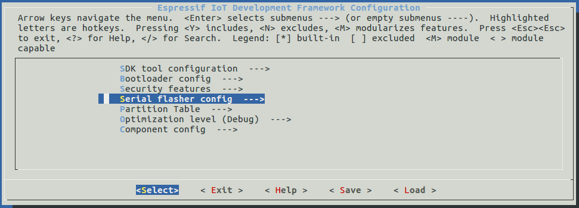

隽恳电子的正恳ESP32模块，相对于目前市场上类似的模块来说，似乎没有什么两样，因为几乎所有的ESP32模块都是参考乐鑫官方提供的参考设计来实现的。各家主要的特色就体现在器件用料和软件支持上。

在硬件设计上，正恳ESP32模块具有以下特点：
1. USB转串口芯片采用Silicon Labs的CP2102，支持windows7/8/10/Visa/XP
2. 可以通过两端的PIN脚直接在面包板上调试程序
3. 板载乐鑫官方的ESP-WROOM-32模块
4. 支持自动下载，无需人工干预
5. 按键采用进口C&K 轻触微型开关
6. 带锂电池充电电路，客户可以在调试完板子之后直接用锂电池供电使用，瞬间开发板变产品
7. 锂电池充电芯片为美国Microchip的MCP73831

正恳ESP32 PINOUT图：


ESP32 特性：

- Xtensa® Dual-Core 32-bit LX6 microprocessors
- CPU频率160MHz~240MHz
- 运行freeRTOS系统
- 1Kbit EFUSE
- 内置4MB W25Q32 NorFlash
- 520KB 内部SRAM（Data & Instruction）
- 448KB 内部ROM
- 802.11 b/g/n/e/i WLAN STA/AP/P2P模式
- Bluetooth 4.2（Classic BT & BLE）

# 开启Hello world之旅

## ESP32 PC开发环境的搭建
ESP32支持Windows，Ubuntu，MacOS环境下开发，编译环境的搭建主要是toolchain交叉编译环境的安装，
可以参考下面的链接：
http://esp-idf.readthedocs.io/en/latest/get-started/index.html#get-started-customized-setup
## 获取ESP-IDF源码
搭建好编译环境之后，就可以在Terminal下通过下面的命令获取ESP32的源码,以ubuntu开发环境为例，其他环境类似：

```
cd ~/esp
git clone --recursive https://github.com/espressif/esp-idf.git
```
## 设置ESP-IDF的toolchain路径
参考下面的链接：
http://esp-idf.readthedocs.io/en/latest/get-started/add-idf_path-to-profile.html
## 创建Hello world工程
拷贝ESP-IDF自带的hello world example工程到~/esp目录：

```
cd ~/esp
cp -r $IDF_PATH/examples/get-started/hello_world
```
 使用USB线连接正恳ESP开发板，此时PC下就会识别到一个CP2102的USB转串口设备。Ubuntu下到通过ls /dev/ttyUSB*查看。
 然后Terminal下继续进行工程的配置：

```
cd ~/esp/hello_world
make menuconfig
```


选择Serial flasher config ->Default serial port去配置程序下载使用的串口，查看LOG和下载程序都是使用的同一个串口，就是上面PC识别到的CP2102串口设备/dev/ttyUSB*（具体*是0还是1根据实际情况来定），然后选择save保存当前的配置，并通过exit退出配置界面。
## 编译和烧写程序
回到~/esp/hello_world工程目录，执行下面的命令来自动编译和下载程序：

```
make flash
```
这一步会编译hello world应用程序以及所依赖的所有ESP-IDF组件，然后自动生成bootloader，分区表，和应用的二进制文件，最后会通过串口自动烧写所有的二进制文件到你的ESP32板子里。
之后，通过Minicom打开/dev/ttyUSB*(115200,8N1,None)，会看到系统的启动log如下：

```
...
Hello world!
Restarting in 10 seconds...
I (211) cpu_start: Starting scheduler on APP CPU.
Restarting in 9 seconds...
Restarting in 8 seconds...
Restarting in 7 seconds...
```
你也可以通过make monitor命令来查看log信息。

```
$ make monitor
MONITOR
--- idf_monitor on /dev/ttyUSB0 115200 ---
--- Quit: Ctrl+] | Menu: Ctrl+T | Help: Ctrl+T followed by Ctrl+H ---
ets Jun  8 2016 00:22:57

rst:0x1 (POWERON_RESET),boot:0x13 (SPI_FAST_FLASH_BOOT)
ets Jun  8 2016 00:22:57
...
```
